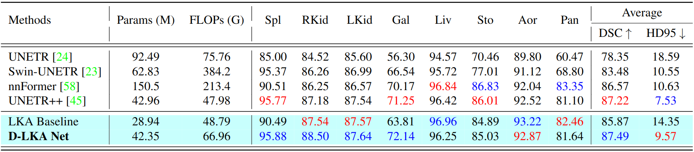
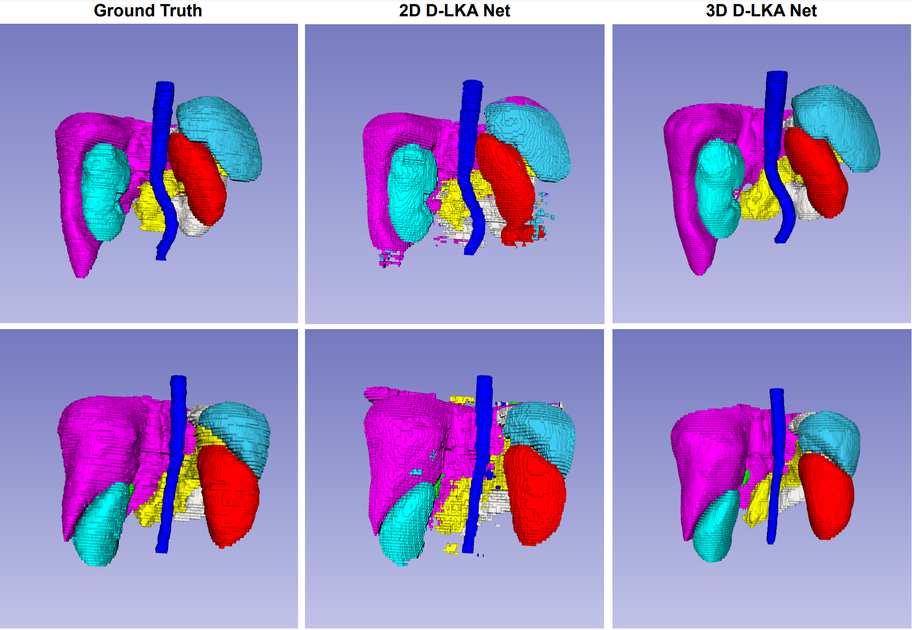

# Beyond Self-Attention: Deformable Large Kernel Attention for Medical Image Segmentation <br> <span style="float: right"><sub><sup>WACV 2024</sub></sup></span>
[](https://arxiv.org/abs/2309.00121)


We have introduced a novel approach called **Deformable Large Kernel Attention (D-LKA Attention)** to enhance medical image segmentation. This method efficiently captures volumetric context using large convolution kernels, avoiding excessive computational demands. D-LKA Attention also benefits from deformable convolutions to adapt to diverse data patterns. We've created both 2D and 3D versions, with the 3D version excelling in cross-depth data understanding. This forms the basis of our new hierarchical Vision Transformer architecture, the *D-LKA Net*, which outperforms existing methods on popular medical segmentation datasets (Synapse, NIH Pancreas, and Skin lesion).

> Reza Azad, Leon Niggemeier, Michael Hüttemann, Amirhossein Kazerouni, Ehsan Khodapanah Aghdam, Yury Velichko, Ulas Bagci and Dorit Merhof

<br>

<p align="center">
  
</p>

## 💥 News 💥
- **`24.10.2023`** | Accepted in WACV 2024! 🥳

- **`16.10.2023`** | Release of 2D, 3D Synapse weights and 3D Pancreas weights.

## Results
### 2D Synapse Dataset
State-of-the-art comparison on the abdominal multi-organ Synapse dataset for 2D methods. The model complexity and performance (DSC, HD95) are shown for all models. The proposed 2D D-LKA Net achieves superior segmentation performance. Abbreviations stand for: Spl: _spleen_, RKid: _right kidney_, LKid: _left kidney_, Gal: _gallbladder_, Liv: _liver_, Sto: _stomach_, Aor: _aorta_, Pan: _pancreas_. Best results are shown in <h style="color:blue;">blue</h>, second best in <h style="color:red;">red</h>.


### 3D Synapse Dataset
State-of-the-art comparison on the abdominal multi-organ Synapse dataset for 3D methods. The model complexity and performance (DSC, HD95) are shown for all models. The proposed 3D D-LKA Net achieves superior segmentation performance. Our model also is considerably small with the lowest number of parameters. Abbreviations stand for: Spl: _spleen_, RKid: _right kidney_, LKid: _left kidney_, Gal: _gallbladder_, Liv: _liver_, Sto: _stomach_, Aor: _aorta_, Pan: _pancreas_. Best results are shown in <h style="color:blue;">blue</h>, second best in <h style="color:red;">red</h>.


### Qualitative Results
While the 2D version achieves great segmentation results in comparison to other 2D models, the main limitation is the lack of inter-slice connections. Here, the 3D models achieve favorable segmentations.
<p align="center">
  
</p>

## 2D Instructions
For detailed instructions for the 2D methods, please refer to the [Readme](2D/README.md) in the 2D folder.

## 3D Instructions
For detailed instructions for the 3D methods, please refer to the [Readme](3D/README.md) in the 3D folder.


## Acknowledgement
This repository is built based on [nnFormer](https://github.com/282857341/nnFormer), [UNETR++](https://github.com/Amshaker/unetr_plus_plus), [transnorm](https://github.com/rezazad68/transnorm), [MCF](https://github.com/WYC-321/MCF), [D3D](https://github.com/XinyiYing/D3Dnet/tree/master). We thank the authors for their code repositories.

## Query

All implementations were done by Leon Niggemeier. For any query please contact us for more information.
```python
leon.niggemeier@rwth-aachen.de
```

## Citation

```bibtex
@article{azad2023beyond,
  title={Beyond Self-Attention: Deformable Large Kernel Attention for Medical Image Segmentation},
  author={Azad, Reza and Niggemeier, Leon and Huttemann, Michael and Kazerouni, Amirhossein and Aghdam, Ehsan Khodapanah and Velichko, Yury and Bagci, Ulas and Merhof, Dorit},
  journal={arXiv preprint arXiv:2309.00121},
  year={2023}
}
```
